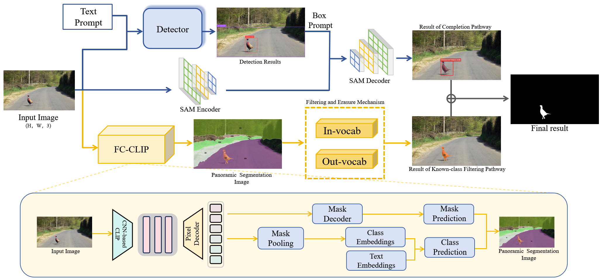

# 🚀 DBAS: Open-World Anomaly Segmentation via Visual-Language Alignment

DBAS is a **dual-branch multimodal framework** for anomaly detection in open-world urban driving environments. By synergistically integrating **vision-language alignment** and **text-conditioned object grounding**, DBAS achieves robust detection of **unknown and unconventional anomalies**—from scattered cargo to unexpected animals.

---


## 🧠 Framework Highlights

DBAS features two complementary branches that collaborate to detect and classify anomalies object set:

* 🔍 **`FC-CLIP` Branch**
  A feature-consistent CLIP-based module for vision-language alignment, supporting image-text retrieval, open-vocabulary classification, and zero-shot reasoning.

* 🤭 **GS Branch**
  A powerful open-set object detector capable of grounding arbitrary text prompts in real-world images, enabling flexible detection of rare and unknown categories.

---

---

## 🚀 Quick Start

### 1️⃣ Environment Setup

```bash
# Create Python environment (recommended Python 3.8+)
conda create -n POAD python=3.8 -y
conda activate POAD

# Clone the repository
git clone https://github.com/fugit0316/POAD.git
cd POAD
```

> ⚠️ Each branch has separate dependencies and setup routines.

---

### 2️⃣ FC-CLIP Branch Setup

```bash
cd FC-CLIP
pip install -r requirements.txt
```

**🔧 Capabilities**:

* CLIP-based vision-language embedding
* Zero-shot image classification
* Open-vocabulary similarity matching

📄 *More details*: [`FC-CLIP/README.md`](./FC-CLIP/README.md)

---

### 3️⃣ GroundingDINO (GS) Branch Setup

```bash
cd GroundingDINO
pip install -r requirements.txt
```

**🔧 Capabilities**:

* Object detection guided by natural language prompts
* Support for unseen categories via open-vocabulary grounding
* Robust localization in urban scenarios

📄 *More details*: [`GroundingDINO/README.md`](./GroundingDINO/README.md)

---

### 4️⃣ (Optional) Segment Anything Module (SAM)

> DBAS optionally supports [Segment Anything Model (SAM)](https://github.com/facebookresearch/segment-anything) for pixel-level anomaly refinement.

**Environment Requirements**:

```bash
cd segment-anything
pip install -e .
```

**Optional but Recommended Dependencies** (for COCO-format mask saving, ONNX export, and example notebooks):

---

## 📌 Applications

* 🚗 Urban anomaly detection for autonomous driving
* 🧠 Open-world perception with language-guided understanding
* 📦 Safety monitoring for unexpected roadside hazards

---

## 💼 Citation

*Coming soon.*
